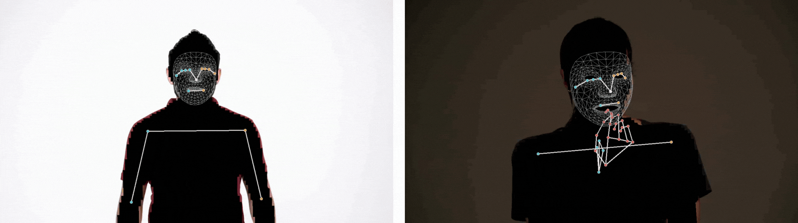
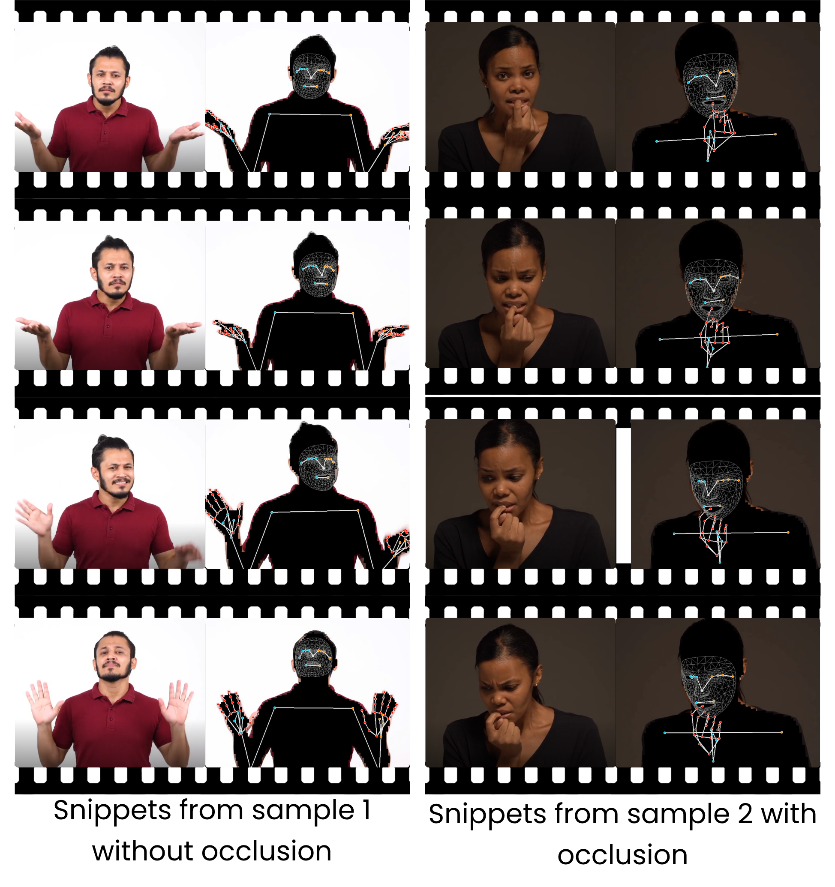

# Masked Piper: Masking personal identities in visual recordings while preserving multimodal information

<div align="center">
<p><a href="https://github.com/WimPouw/TowardsMultimodalOpenScience/blob/main/Images/Capture.JPG?raw=true" target="_blank"><strong>Masked-Piper</strong></a>
</div>


## Introduction
This approach adopts Masked-Piper, a structured video anonymisation framework that **combines binary silhouette masking with explicit kinematic representations** 

Given an input video, Masked-Piper iteratively processes each frame to produce: (i) a binary foreground mask that removes textured appearance and (ii) a set of time-aligned kinematic keypoints covering body pose, hands and facial geometry.

<div align="center">

</div>

<div align="center">

</div>

This simpler approach **utilises MediaPipe to track 33 body pose keypoints, 42 hand keypoints and a dense facial mesh consisting of 478 facial landmarks**, each represented in 3D coordinates. 


## Installation
### 1. Clone the code and prepare the environment 🛠️
```bash
git clone git@github.com:Forensic-Face-Anon/MaskedPiper.git
cd MaskedPiper

# create env using conda
conda create -n maskpiper python=3.8
conda activate maskpiper
```
```bash
pip install -r requirements.txt
```
### 2. Generate binary masking (inference)
_Remember to update lines 22 `mypath = "./driving/"` before running the code._
```bash
# Takes in a folder of videos (*.mp4) to process
python Masked-PiperPY.py
```

Default output directory: `./Output_Experiment/` & `./Output_TimeSeries/`

# Acknowledgements 💖
```
Owoyele, B., Trujillo, J., De Melo, G., Pouw, W. (2022). Masked-Piper: Masking personal identities in visual recordings while preserving multimodal information. *SoftwareX*. doi: [10.1016/j.softx.2022.101236](https://www.sciencedirect.com/science/article/pii/S2352711022001546)
```